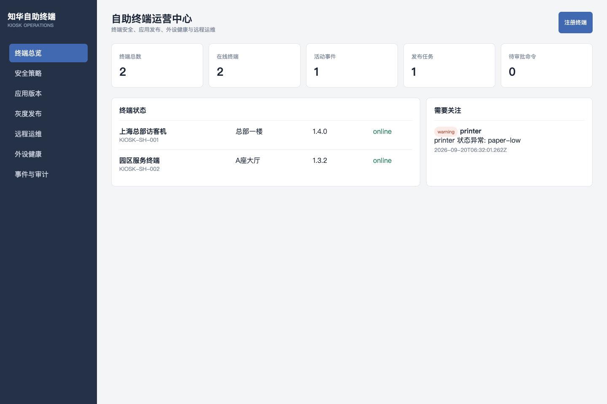
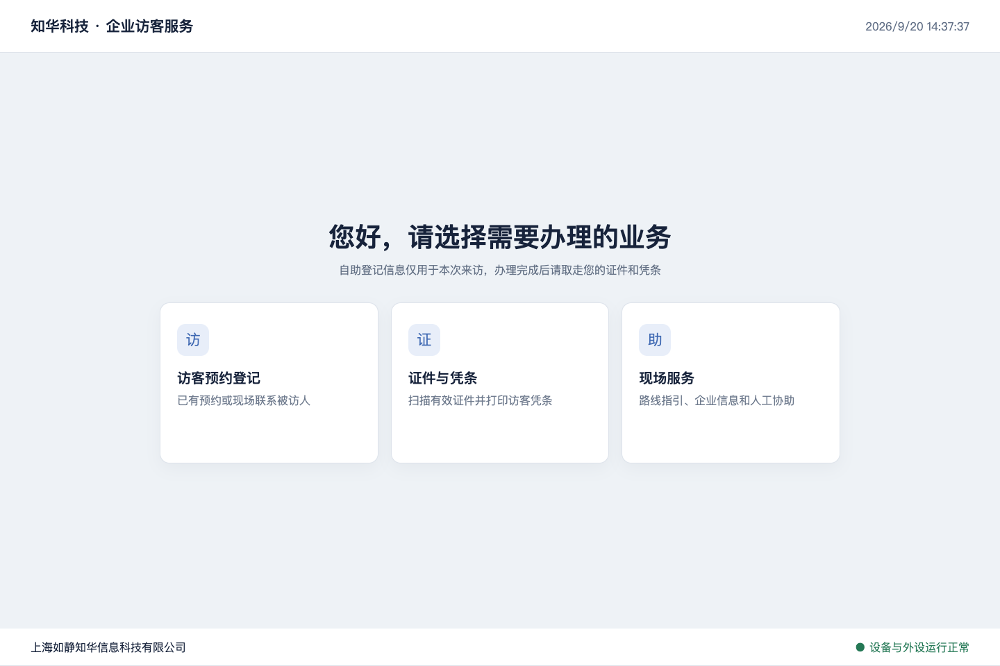

# ZhuaTech Kiosk · 企业自助终端管理平台

适用于访客机、政企服务终端、查询机和园区自助设备的社区源码平台。工程同时包含**后台管理端、终端业务端和可执行 Agent 模拟器**，核心链路不是空架子。

由[知华科技（上海如静知华信息科技有限公司）](https://www.zhuatech.cn/)维护。硬件外设接入、整机定制、商业授权或软件项目外包，请微信添加 `zhuatech` 或 `zhuatech2`。

| 管理端 | 自助终端端 |
| --- | --- |
|  |  |

## 已实现的企业能力

- 终端注册与设备密钥摘要存储；场所、型号、标签和在线状态。
- 域名白名单、USB 禁用、空闲超时、维护窗口等安全策略及版本号。
- 应用包 SHA-256 校验、终端目标集、按批次灰度发布和逐机结果。
- 打印机、扫码器、摄像头等外设健康上报，异常自动去重建立事件。
- 重启系统、清缓存等高风险指令必须双人审批，申请人不可自审。
- Idempotency-Key 防止命令重试重复创建；管理行为写入审计记录。
- 浏览器终端界面与 Node.js Agent 模拟器，真实外设走适配接口。

## 运行与测试

```bash
npm test
KIOSK_API_KEY=zhuatech-demo-key npm start
```

- 管理端：`http://127.0.0.1:18085/`
- 终端端：`http://127.0.0.1:18085/terminal`
- Agent：设置 `TERMINAL_ID` 后执行 `npm run agent`

也可运行 `docker compose up --build`。社区版 Agent 是可测试的协议模拟器，不宣称已经驱动任意品牌打印机、证件阅读器或支付设备；真实外设必须按厂商 SDK 实现适配器并进行现场安全验收。

## 许可

仅允许个人学习、研究和交流，不得商用。企业生产、项目交付、SaaS、整机销售及收费服务必须取得上海如静知华信息科技有限公司书面授权。本项目是 source-available 社区源码，而非 OSI 定义的开源许可证项目。

## 微信咨询

| 微信号 `zhuatech` | 微信号 `zhuatech2` |
| --- | --- |
|  |  |
